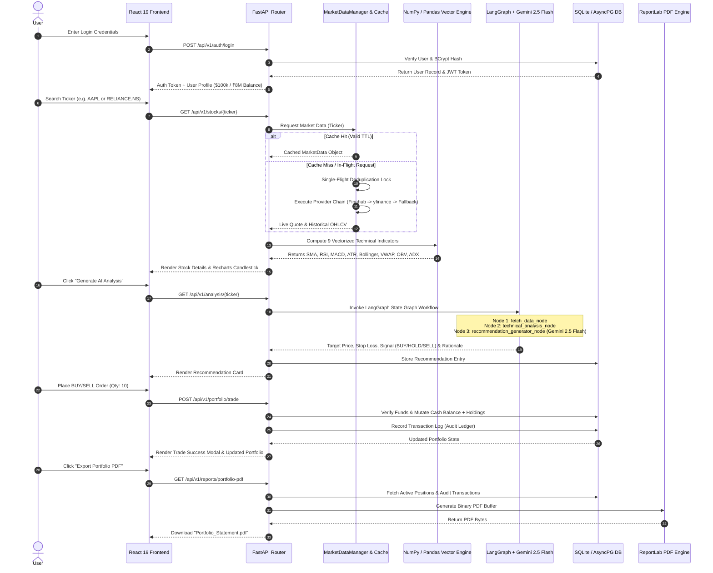

# High-Level Design (HLD) Project Report & Architecture Specification

## Project Name
**AlphaAdvisor AI - AI-Powered Dual-Market Stock Analysis & Virtual Portfolio Advisor**

**Document Version**: 3.0.0  
**Target Audience**: Software Architects, Technical Leads, Developers & Stakeholders  
**Status**: Production Baseline  

---

## 1. Executive Summary & Core Objectives

**AlphaAdvisor AI** is a production-grade, full-stack financial technology platform designed to deliver real-time equity market analysis, automated quantitative technical & fundamental evaluation, dual-currency virtual portfolio management, and AI-assisted financial advisory.

### Core Objectives
1. **Dual-Country Capital Market Integration**: Full native support for **US Stock Markets (NASDAQ & NYSE)** (e.g. `AAPL`, `NVDA`, `TSLA`, `MSFT`) in USD ($) and the **Indian Stock Market (NSE)** (e.g. `RELIANCE.NS`, `TCS.NS`, `INFY.NS`) in INR (₹).
2. **Vectorized Mathematical Engine**: High-performance, zero-latency pure NumPy/Pandas calculation of **9 technical indicators** (SMA, EMA, RSI, MACD, ATR, Bollinger Bands, VWAP, OBV, ADX).
3. **LangGraph Multi-Node AI Engine**: State-machine recommendation pipeline powered by Google Gemini 2.5 Flash (`gemini-2.5-flash`) that evaluates technical momentum, support/resistance levels, and fundamental metrics to produce structured Buy/Hold/Sell target prices with confidence ratings.
4. **Conversational Financial Advisor Chatbot**: Multi-turn advisor capable of contextual stock analysis, portfolio diversification guidance, and quantitative indicator explanations with context injection.
5. **Virtual Trading Account & Immutable Audit Ledger**: Risk-free virtual trading environment pre-funded with **$100,000.00 USD** and **₹8,000,000.00 INR**, supported by transaction execution auditing.
6. **Dynamic PDF Statement Generator**: ReportLab PDF compilation of portfolio valuation snapshots, asset allocation breakdowns, and historical transaction logs.
7. **System Resilience & Fallback Architecture**: Ordered 5-stage provider chain (Finnhub $\rightarrow$ Twelve Data $\rightarrow$ Alpha Vantage $\rightarrow$ yfinance $\rightarrow$ Synthetic Fallback) with in-memory single-flight request deduplication & TTL caching alongside deterministic rule-engine fallback when Gemini API keys are omitted.

---

## 2. High-Level Architecture & Topology

The platform follows a decoupled, 4-tier microservice-ready architecture comprising the **Presentation Tier**, **API Gateway & Core Logic Tier**, **AI Reasoning Engine Tier**, and **Data & Market Integration Tier**.

```
+-----------------------------------------------------------------------------------+
|                                  PRESENTATION TIER                                |
|  React 19 + TypeScript | Vite 5 | TailwindCSS (Glassmorphic Dark Theme) | Recharts  |
+----------------------------------------+------------------------------------------+
                                         | REST APIs (Axios + JWT)
                                         v
+-----------------------------------------------------------------------------------+
|                           API GATEWAY & CORE BACKEND TIER                         |
|  FastAPI 0.110 Async Framework | Uvicorn ASGI Server | BCrypt / Python-Jose JWT   |
|  Routers: Auth | Stocks | Portfolio | Analysis | Chat | Watchlist | Admin | Reports |
+-------+--------------------------------+----------------------------------+-------+
        |                                |                                  |
        v                                v                                  v
+-----------------------+  +-------------------------------+  +---------------------+
|   DATA & MARKET TIER  |  |    AI REASONING ENGINE TIER   |  |   PERSISTENCE TIER  |
| Provider Pipeline (5) |  | LangGraph 0.0.30 State Graph  |  | SQLAlchemy 2.0 Async|
| MarketDataCache (TTL) |  | Google Gemini 2.5 Flash LLM   |  | SQLite / AsyncPG    |
| NumPy Vector Engine   |  | Deterministic Rule Fallback   |  | Alembic Migrations  |
+-----------------------+  +-------------------------------+  +---------------------+
```

---

## 3. Simple Project Workflow (How It All Works Together)

The diagram below illustrates how a user request flows through the entire system: from the React Frontend, through FastAPI routing, yfinance/provider fetching, NumPy calculations, LangGraph AI analysis with Gemini 2.5 Flash, to DB mutation and PDF generation.



### Key Workflow Phases Explained
1. **Authentication & Session State**: On login, FastAPI returns a JWT token. The React client saves the token in `localStorage` and maintains currency preference (USD vs INR) globally.
2. **Resilient Market Data Pipeline**: When a stock is queried, `MarketDataManager` checks its in-memory TTL cache. If multiple users query the same stock simultaneously, **Single-Flight Deduplication** merges them into 1 backend fetch across the provider chain (Finnhub $\rightarrow$ TwelveData $\rightarrow$ AlphaVantage $\rightarrow$ yfinance $\rightarrow$ Fallback).
3. **Quantitative Indicator Math**: Raw OHLCV price series are passed to the vectorized NumPy/Pandas engine, computing 9 technical indicators instantly without blocking the event loop.
4. **LangGraph AI Recommendation**: LangGraph executes a deterministic 3-node graph. If `GEMINI_API_KEY` is present, `gemini-2.5-flash` creates synthesized investment thesis reports. If absent or failing, the deterministic rule engine runs seamlessly.
5. **Virtual Portfolio & Audit Ledger**: Trading operations execute inside single database transactions (`aiosqlite`/`asyncpg`), updating cash balances and writing immutable logs to the `transactions` table.
6. **PDF Generation**: Binary PDF reports are generated on-the-fly via ReportLab and streamed directly to the browser for instant user download.

---

## 4. Comprehensive Feature Inventory

### Feature 1: Dual-Market Equity Coverage & Live Search
- **US Markets**: Native support for NASDAQ & NYSE ticker symbols (`AAPL`, `MSFT`, `GOOGL`, `AMZN`, `NVDA`, `TSLA`, etc.) denominated in USD ($).
- **Indian Markets**: Native support for NSE tickers (`RELIANCE.NS`, `TCS.NS`, `INFY.NS`, `HDFCBANK.NS`, `TATAMOTORS.NS`) denominated in INR (₹).
- **Market Switcher**: Global UI Context allowing users to seamlessly toggle between US and Indian equity markets.
- **Search Engine**: Pre-seeded stock registry + provider auto-completion.

### Feature 2: Vectorized 9-Technical Indicator Engine
Calculates 9 technical indicators synchronously using pure NumPy and Pandas:
- **Simple Moving Average (SMA)** (20-day, 50-day)
- **Exponential Moving Average (EMA)** (12-day, 26-day)
- **Relative Strength Index (RSI)** (14-period)
- **Moving Average Convergence Divergence (MACD)** (12/26/9 periods)
- **Average True Range (ATR)** (14-period volatility)
- **Bollinger Bands** (20-period SMA $\pm$ 2 Standard Deviations)
- **Volume Weighted Average Price (VWAP)**
- **On-Balance Volume (OBV)**
- **Average Directional Index (ADX)** (14-period trend strength)

### Feature 3: LangGraph Multi-Node AI Recommendation Engine
- **State Graph Topology**: `fetch_data_node` $\rightarrow$ `technical_analysis_node` $\rightarrow$ `recommendation_generator_node`.
- **Target Price Determination**: Calculates exact mathematical Target Price and Stop Loss based on ATR volatility bounds and key resistance/support levels.
- **Output Schema**: Recommendation Signal (`BUY`, `HOLD`, `SELL`), Confidence Rating (%), Summary, Technical Analysis, Fundamental Rationale, Risk Assessment, Entry Price, Stop Loss, Target Price, Time Horizon, and Educational Disclaimer.

### Feature 4: Gemini 2.5 Flash Financial Advisor Chatbot
- **Conversational AI**: Multi-turn dialogue powered by `gemini-2.5-flash`.
- **Context Injection**: Dynamically injects live stock quote, 9 technical indicators, and user portfolio holdings into the prompt state.
- **Grounding Guards**: Strict system instructions preventing price hallucination.

### Feature 5: Dual-Currency Virtual Portfolio & Trading Execution Engine
- **Virtual Balances**: Initial allocation of **$100,000 USD** and **₹8,000,000 INR**.
- **Real-Time Trade Execution**: Immediate virtual BUY and SELL operations with cash balance verification and partial position liquidation.
- **Portfolio Analytics**: Total Invested Capital, Current Market Value, Absolute PnL ($ / ₹), Percentage PnL (%), and Sector Asset Allocation Breakdown.
- **Audit History**: Immutable transaction execution table recording price per share, timestamp, market type, and executed volume.

### Feature 6: Price Alert & Watchlist Management
- **Bookmark Tracker**: Save equity tickers to personal watchlist.
- **Price Target Alerts**: Set alert trigger prices and custom notes per equity.

### Feature 7: Dynamic PDF Portfolio Valuation Report Generation
- **ReportLab Engine**: On-the-fly binary PDF compilation (`/api/v1/reports/portfolio-pdf`).
- **Document Structure**: Professional header, user profile details, multi-currency cash balances, active portfolio holdings table, and complete transaction execution logs.

### Feature 8: System Administration & Telemetry Dashboard
- **Role-Based Access Control**: Strict `ADMIN` vs `USER` permission enforcement.
- **System Telemetry**: System status overview, total registered user count, total trades executed, and active volume.
- **User Directory**: View and manage all registered user accounts.

### Feature 9: Market Data & AI Resiliency Architecture
- **Provider Fallback Pipeline**: 5 ordered stages (Finnhub $\rightarrow$ Twelve Data $\rightarrow$ Alpha Vantage $\rightarrow$ yfinance $\rightarrow$ Synthetic Fallback).
- **Single-Flight Request Deduplication**: Prevents duplicate concurrent API calls across threads.
- **In-Memory Thread-Safe Caching**: Configurable TTLs (60s Quote, 300s Historical Candles) to eliminate rate limits.
- **LLM Rule Fallback**: Automatic fallback to deterministic quantitative rule analysis if `GEMINI_API_KEY` is not configured or fails.

---

## 5. Technical Indicators Mathematical Formulations

### 1. Simple Moving Average (SMA)
$$\text{SMA}_N(t) = \frac{1}{N} \sum_{i=0}^{N-1} P_{t-i}$$

### 2. Exponential Moving Average (EMA)
$$\alpha = \frac{2}{N + 1}$$
$$\text{EMA}_N(t) = \left( P_t \times \alpha \right) + \left( \text{EMA}_N(t-1) \times (1 - \alpha) \right)$$

### 3. Relative Strength Index (RSI - 14 Period)
$$\text{RS} = \frac{\text{Average Gain}_{14}}{\text{Average Loss}_{14}}$$
$$\text{RSI} = 100 - \left( \frac{100}{1 + \text{RS}} \right)$$

### 4. Moving Average Convergence Divergence (MACD)
$$\text{MACD Line} = \text{EMA}_{12}(P) - \text{EMA}_{26}(P)$$
$$\text{Signal Line} = \text{EMA}_9(\text{MACD Line})$$
$$\text{Histogram} = \text{MACD Line} - \text{Signal Line}$$

### 5. Average True Range (ATR - 14 Period)
$$\text{TR}_t = \max\left( H_t - L_t, \, |H_t - C_{t-1}|, \, |L_t - C_{t-1}| \right)$$
$$\text{ATR}_{14}(t) = \frac{1}{14} \sum_{i=0}^{13} \text{TR}_{t-i}$$

### 6. Bollinger Bands (20 Period)
$$\text{Middle Band} = \text{SMA}_{20}(P)$$
$$\text{Upper Band} = \text{SMA}_{20}(P) + \left( 2 \times \sigma_{20}(P) \right)$$
$$\text{Lower Band} = \text{SMA}_{20}(P) - \left( 2 \times \sigma_{20}(P) \right)$$

### 7. Volume Weighted Average Price (VWAP)
$$\text{Typical Price}_t = \frac{H_t + L_t + C_t}{3}$$
$$\text{VWAP} = \frac{\sum \left( \text{Typical Price}_t \times V_t \right)}{\sum V_t}$$

### 8. On-Balance Volume (OBV)
$$\text{OBV}_t = \text{OBV}_{t-1} + \begin{cases} V_t & \text{if } C_t > C_{t-1} \\ 0 & \text{if } C_t = C_{t-1} \\ -V_t & \text{if } C_t < C_{t-1} \end{cases}$$

### 9. Average Directional Index (ADX - 14 Period)
$$+\text{DM} = H_t - H_{t-1}, \quad -\text{DM} = L_{t-1} - L_t$$
$$\text{DX} = 100 \times \frac{|+\text{DI}_{14} - -\text{DI}_{14}|}{+\text{DI}_{14} + -\text{DI}_{14}}$$
$$\text{ADX} = \text{EMA}_{14}(\text{DX})$$

---

## 6. LangGraph AI Engine & Chatbot State Machine

The recommendation pipeline runs as a deterministic state machine using `langgraph.graph.StateGraph`.

```
           +---------------------------------------+
           |                START                  |
           +-------------------+-------------------+
                               |
                               v
           +---------------------------------------+
           |           fetch_data_node             |
           |  - Ingest Quote & Historical OHLCV    |
           |  - Calculate 9 Technical Indicators   |
           +-------------------+-------------------+
                               |
                               v
           +---------------------------------------+
           |       technical_analysis_node         |
           |  - SMA 20/50 Crossover Evaluation     |
           |  - Support/Resistance & ATR Bounds    |
           |  - RSI & MACD Momentum Signals        |
           +-------------------+-------------------+
                               |
                               v
           +---------------------------------------+
           |    recommendation_generator_node      |
           |  - LLM Narrative (Gemini 2.5 Flash)   |
           |  - Fallback: Rule Engine Execution    |
           |  - Format Final JSON Payload          |
           +-------------------+-------------------+
                               |
                               v
           +---------------------------------------+
           |                 END                   |
           +---------------------------------------+
```

---

## 7. Database Schema & Data Models Design

The application utilizes SQLAlchemy 2.0 Async declarative ORM with automatic migrations via Alembic.

```
 +------------------+        +--------------------+        +-------------------+
 |      users       |        |     portfolios     |        |   transactions    |
 +------------------+        +--------------------+        +-------------------+
 | id (PK)          |<-------| user_id (FK)       |   +---| user_id (FK)      |
 | email            |        | ticker             |   |   | ticker            |
 | password_hash    |        | market (IN/US)     |   |   | transaction_type  |
 | role (USER/ADMIN)|        | quantity           |   |   | quantity          |
 | preferred_country|        | average_buy_price  |   |   | price_per_share   |
 | balance_usd      |        | total_invested     |   |   | total_amount      |
 | balance_inr      |        +--------------------+   |   | currency          |
 +--------+---------+                                 |   +-------------------+
          |                  +--------------------+   |
          |                  |     watchlists     |   |    +------------------+
          +------------------| user_id (FK)       |   +----|   recommendations|
          |                  | ticker             |        +------------------+
          |                  | target_alert_price |        | id (PK)          |
          |                  +--------------------+        | user_id (FK)     |
          |                                                | ticker           |
          |                  +--------------------+        | recommendation   |
          +------------------|   chat_histories   |        | confidence       |
                             +--------------------+        | entry/target/stop|
                             | user_id (FK)       |        +------------------+
                             | user_query         |
                             | ai_response        |
                             +--------------------+
```

---

## 8. Directory & Technology Map

```
Uday/
├── backend/
│   ├── app/
│   │   ├── ai/               # LangGraph Agent, Chatbot & Gemini LLM Integration
│   │   ├── market/           # Multi-Provider Chain, Cache & Single-Flight Dedup
│   │   ├── models/           # SQLAlchemy 2.0 Async Data Models
│   │   ├── routers/          # FastAPI Routers (Auth, Stocks, Portfolio, Chat, Admin, Reports)
│   │   ├── services/         # Portfolio & Report Generation Logic (ReportLab PDF)
│   │   ├── utils/            # NumPy 9-Technical Indicator Mathematics
│   │   ├── config.py         # App Settings & Pydantic Environment Vars
│   │   └── main.py           # FastAPI Core Application Entry Point
│   ├── alembic/              # Database Schema Migrations
│   └── requirements.txt      # Python Dependencies
├── frontend/
│   ├── src/
│   │   ├── api/              # Axios HTTP Gateway Integration
│   │   ├── components/       # UI, Charts (Recharts), AI Chat & Portfolio Modals
│   │   ├── context/          # React Auth & Dual-Currency Context
│   │   ├── pages/            # Application Views (Explorer, Stock Detail, Portfolio, Admin)
│   │   └── App.tsx           # Router & Layout Layout Specification
│   ├── package.json          # Frontend Node Dependencies (React 19, Vite 5)
│   └── vite.config.ts        # Vite Build Configuration
└── report.md                 # HLD Project Report Document
```

---

## 9. API Endpoint Directory

| Category | Endpoint | Method | Description |
|---|---|---|---|
| **Auth** | `/api/v1/auth/register` | `POST` | User Registration & Initial Balance Allocation |
| **Auth** | `/api/v1/auth/login` | `POST` | OAuth2 Password Login & JWT Token Emission |
| **Auth** | `/api/v1/auth/me` | `GET` | Get Current Authenticated User Profile |
| **Stocks** | `/api/v1/stocks/search` | `GET` | Live Stock Ticker Auto-Complete Search |
| **Stocks** | `/api/v1/stocks/{ticker}` | `GET` | Real-Time Quote & Historical Candlestick Series |
| **Stocks** | `/api/v1/stocks/{ticker}/indicators` | `GET` | Computes Vectorized 9-Technical Indicators |
| **Analysis** | `/api/v1/analysis/{ticker}` | `GET` | Runs LangGraph AI Recommendation Engine |
| **Chat** | `/api/v1/chat/` | `POST` | Conversational Gemini Financial Advisor |
| **Portfolio**| `/api/v1/portfolio/` | `GET` | Fetch Holdings, Allocation & PnL |
| **Portfolio**| `/api/v1/portfolio/trade` | `POST` | Execute Virtual BUY/SELL Transaction |
| **Reports** | `/api/v1/reports/portfolio-pdf` | `GET` | Dynamic Binary PDF Statement Download |
| **Admin** | `/api/v1/admin/telemetry` | `GET` | System Metrics, User Count & Total Trades |
| **Admin** | `/api/v1/admin/users` | `GET` | Registered User Directory Management |

---

## 10. Deployment & Execution Instructions

### 1. Backend Setup (FastAPI & Python 3.11+)
```bash
cd backend
python -m venv .venv
source .venv/bin/activate  # On Windows: .venv\Scripts\activate
pip install -r requirements.txt
uvicorn app.main:app --reload --port 8000
```

### 2. Frontend Setup (Vite & React 19)
```bash
cd frontend
npm install
npm run dev
```

---
*Report updated and validated for AlphaAdvisor AI Production System Architecture.*
